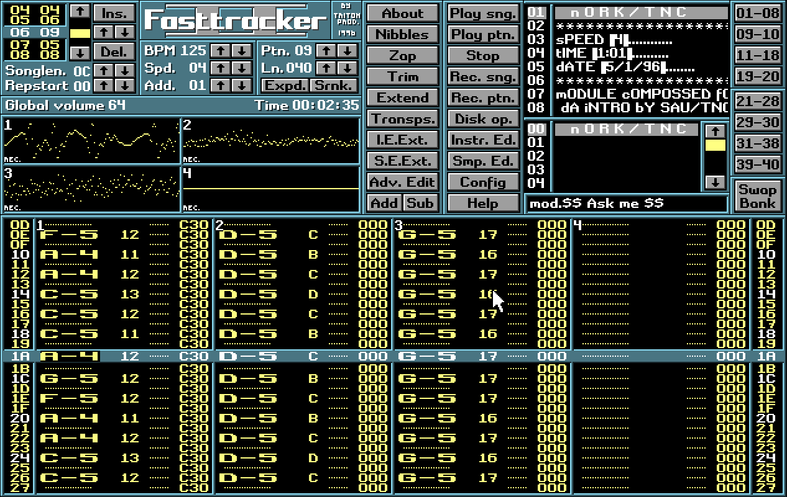

# [Fasttracker II](https://en.wikipedia.org/wiki/FastTracker_2) clone mirror



# [Releases download](https://github.com/tpanj/ft2/releases)
Requirements for running app:
* Windows - can be run on Windows XP sp2+
* Linux - Ubuntu 18.04 LTS + or others
* Mac OS X to be done by someone with MAC

# Compiling
Whole app executable is linked staticly into single standalone file.
Sources contains vanilla stripped SDL2 stable 2.0.10 library with removed some items (`rm -fr android-project/ acinclude/ autogen.sh build-scripts configure* docs test VisualC* Xcode*`).
Various IDEs or console toolchains can be used generated from cmake and that is why project has no other project files committed. 

If you want to build from sources by yourself, download sources or clone repository. CMake build tool is mandatory besides c compiler and linker.

## Windows (with VS201X)
```dos
REM repo is in shared folder ft2_cloned_dir outside Vbox  
mkdir build-ft2
cd build-ft2
cmake -A Win32 \\VBOXSVR\ft2_cloned_dir
start ft2-clone.sln
```

Set in IDE to release and on project ft2-clone set to MFC to Static and toolset to v141_xp.

## Linux
```bash
git clone https://github.com/tpanj/ft2.git
cd ft2; mkdir build; cd build
cmake -DCMAKE_BUILD_TYPE=Release ..
```

# Source
All credits goes to Olav → https://16-bits.org/ft2.php
